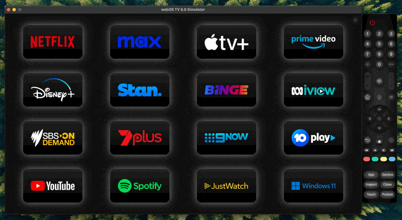

# LG TV App Launcher & Media State Reporter

There are 2 components to this LG TV app:

- **App Launcher**: A full-screen UI featuring large app icons for your favourite TV apps, with clear animations to show which app is selected. This repository includes automations so Home Assistant can load the app launcher when it detects the TV is first turned on.
- **Media State Reporter**: A background service that reports media play state (playing/paused/etc.) to Home Assistant via a MQTT connection. This is required for some older LG TVs ([pre webOS 7?](https://github.com/home-assistant/core/issues/91709)) that do not expose this through the core LG TV Home Assistant integration. If webOS 7 or higher is detected, only the app launcher will be installed.

The app launcher handles the TV remote's mouse movement and directional/select keys as shown below. There is an indicator in the top right corner which shows wether the media play state is successfully being reported to Home Assistant (connected = green, connection pending = yellow, error = red). Clicking on this indicator loads an overlay displaying log messages.



## Installation
### Prerequisite Tasks
1. [Enable Developer Mode](https://webostv.developer.lge.com/develop/getting-started/developer-mode-app) on your LG TV (root not required!).
2. [Install webOS CLI](https://webostv.developer.lge.com/develop/tools/cli-installation) on a computer on the same network as the TV (optionally, [install webOS studio](https://webostv.developer.lge.com/develop/tools/webos-studio-installation) if you want to customise and/or use the simulator).
3. [Set up the connection to your TV using the webOS CLI](https://webostv.developer.lge.com/develop/getting-started/developer-mode-app#connecting-tv-and-pc).
4. [Add the LG webOS TV integration to Home Assistant](https://www.home-assistant.io/integrations/webostv/).
5. [Install a MQTT broker on Home Assistant](https://www.home-assistant.io/integrations/mqtt/)[\^](#if-pre-webos-7-otherwise-not-required).

### Clone & Configure
1. Clone this repository on the computer with webOS CLI installed.
2. Copy `configMQTT.example.json` to `configMQTT.json` and modify the contents with the `host`/`port`/`username`/`password`/`deviceID` as appropriate for your MQTT setup[\^](#if-pre-webos-7-otherwise-not-required). If you have multiple TVs, adjust `deviceID` to specify the Home Assistant sensor names (`sensor.[deviceID]_state`) - they must be unique.
3. Modify the top of `tv-app/script.js` with your favourite apps (maximum of 16), and change the corresponding app icons in `tv-app/icons`.
4. You'll need to use an old version of `node` for webOS CLI interactions with older TVs (see [here](https://webostv.developer.lge.com/develop/guides/js-service-basics#supported-nodejs-version)). The suggested version did not work for me, but I used v16 without error (`nvm use 16`).

### Package, Install, Verify
1. Run `package-and-install.sh` to install the app launcher and media state reporter to your TV (the latter is skipped if webOS 7 or above is detected).
2. Open the app (it will appear at the end of the app list on your TV).
3. Verify the UI works as expected, then select the service indicator in the top right to check the logs for warnings/errors[\^](#if-pre-webos-7-otherwise-not-required).
4. Verify the TV's play state is auto discovered and correctly reporting in Home Assistant[\^](#if-pre-webos-7-otherwise-not-required).

### Automate Startup
Set the App Launcher & Media State Reporter to start automatically when the TV is turned on with a Home Assistant automation like the following. I implemented this with AppDaemon instead, which you can see [here](https://github.com/danVnest/home-assistant/blob/main/appdaemon/apps/media.py).

``` yaml
alias: Open the app launcher when TV turned on
description: "Open the app launcher (and media state reporting service) on the TV when it is turned on"
triggers:
  - trigger: state
    entity_id:
      - media_player.tv
    to: "on"
condition: []
actions:
  - action: media_player.select_source
    data:
      source: App Launcher & Media State Reporter
    target:
      entity_id: media_player.tv
mode: single
```

### Automate Developer Mode Renewal
1. Run the following SSH command, replacing `<TV-ID>` and `<TV-IP>`:
`ssh -i ~/.ssh/<TV-ID>_webos -p 9922 prisoner@1<TV-IP> -oHostKeyAlgorithms=+ssh-rsa -oPubkeyAcceptedAlgorithms=+ssh-rsa "cat /var/luna/preferences/devmode_enabled; echo"`
2. Add the following `rest_command` action to Home Assistant, replacing `<KEY>` with the output from the previous step:

	```yaml
	rest_command:
		renew_lgtv_developer_mode_session:
			url: "https://developer.lge.com/secure/ResetDevModeSession.dev?sessionToken=<KEY>"
	```
    
3. Add the following automation to call the above rest command to renew the LG TV developer mode session weekly:

	```yaml
	alias: Renew LG TV developer mode session weekly
	description: "Required to use TV app launcher and media state reporter"
	actions:
		- action: rest_command.renew_lgtv_developer_mode_session
	triggers:
		- trigger: time
		  at: "01:01:01"
	conditions:
		- condition: time
		  weekday:
		    - sun
	mode: single
	```


## Relevant Resources
I was previously using a mix of [SLG](https://github.com/SLG/lgtv2mqtt)'s and [YorkshireIoT](https://github.com/YorkshireIoT/lg2mqtt)'s solutions for reporting TV play state. They provided a great foundation for the state reporting component of this solution.

The following is a list of repositories/issues that were useful in figuring out TV play state reporting:

- [https://github.com/home-assistant/core/issues/91709](https://github.com/home-assistant/core/issues/91709)
- [https://github.com/home-assistant-libs/aiowebostv/pull/178](https://github.com/home-assistant-libs/aiowebostv/pull/178)
- [https://github.com/bendavid/aiopylgtv/issues/39#issuecomment-1014702695](https://github.com/bendavid/aiopylgtv/issues/39#issuecomment-1014702695)
- [https://community.openhab.org/t/detecting-play-pause-state-of-lg-webos-tv/160043/45](https://community.openhab.org/t/detecting-play-pause-state-of-lg-webos-tv/160043/45)

## Other Notes
- I used webOS Studio Simulator (webOS 6.0) and an LG C1 TV (6.5.1, firmware version 03.52.50) during development.
- If your TV is rooted you can directly report play state through the Home Assistant LG webOS TV integration by using [lxp's solution](https://github.com/lxp/webos-share-playstate).
- If you are modifying the app launcher with your favourite apps, you can get their app IDs by monitoring the service logs.


###### ^ if pre webOS 7, otherwise not required